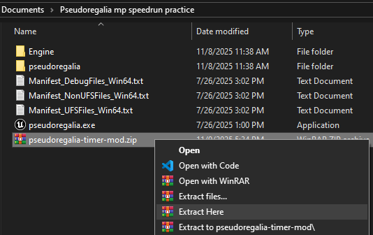

# pseudoregalia-timer-mod

Speedrun focused practice mod for Pseudoregalia that lets you define and time segments.

A segment is defined by a start and end event. These are the currently supported events:

* The Start Game event is triggered when loading into the game from the title screen into Dilapidated Dungeon.
* The End Game event is triggered when defeating the final boss.
* Collectible events are triggered when touching a specific collectible. Collectibles include all main abilities, aspects, outfits, health pieces, major keys, and small keys.
* Transition events are triggered when loading into a zone after going through a specific transition.
* Enter Room events are triggered when the "active room" variable used by the map system is updated to a specific room id. Refer to the [maps](./images/maps/) to see which room has which id in each zone.

The timer starts when the start event is triggered and ends when the end event is triggered. Every event that is triggered is printed to the UE4SS console, whether or not the timer is running. However, if the timer is running when an event is triggered, the current time will also be printed to the console.

Your best time for each segment is stored until you quit the game, so make sure to save them somewhere if you want to remember your best times long term. Practicing a segment when you already have a best time will show that time and a comparison in addition to the actual timer.

# How To Install

1. Install [UE4SS 3.0.1](https://github.com/UE4SS-RE/RE-UE4SS/releases/tag/v3.0.1).

1. Download `pseudoregalia-timer-mod.zip` from the [Releases](https://github.com/highrow623/pseudoregalia-timer-mod/releases) page.

1. Extract `pseudoregalia-timer-mod.zip` directly into the `Pseudoregalia` folder.

   

1. Open `Pseudoregalia/pseudoregalia/Binaries/Win64/Mods/mods.txt` and add a new line with this text:

   ```
   PseudoregaliaTimerMod : 1
   ```

1. Install Custom Options Framework and any other mods you want (see below).

# Other Mods

There are many mods that may be helpful when doing speedrun practice (see the pins in #pseudo-all-categorys in the discord for a good list). These are ones I've found especially useful when using this mod:

* [Custom Options Framework](https://www.nexusmods.com/pseudoregalia/mods/66) **[REQUIRED]** - This is necessary to see the options for this mod in the pause menu, which is where you set the start/end events for the segment you are timing.

* [Pseudo Menu](https://www.nexusmods.com/pseudoregalia/mods/36) - All the timer mod provides is the timer, so it's up to you to get a save in the proper state for testing a segment. This mod gives you a lot more saves to work with, and it also makes it easier to create a save for practicing a segment that requires certain items.

   *Note: this mod makes loading into the game work a bit differently, so I recommend uninstalling this mod when practicing a segment beginning from the Start Game event.*

* [Reset Button](https://www.nexusmods.com/pseudoregalia/mods/31) - If the segment you're practicing requires getting any items, resetting is necessary to get your save back into a state to re-run the segment. It also resets the timer. I recommend binding the quick reset to F4 to make it easy to use with the position saver mod.

* [Pseudoregalia Position Saver](https://www.nexusmods.com/pseudoregalia/mods/63) - This mod is useful for setting consistent start locations for testing segments and quickly getting back to them after resetting. The way this mod reloads the area doesn't interact with the game's reset function, meaning it leaves your save in the same state. So I recommend saving positions as "Teleport Only" so you can quickly reset by pressing F4 then F5. Just make sure you save your game in the same zone as where your segment starts.

I also recommend the [Show Triggers](https://www.nexusmods.com/pseudoregalia/mods/81) and [Free Cam](https://www.nexusmods.com/pseudoregalia/mods/70) mods.

# Limitations

* Timing may not exactly match the autosplitter, but it should hopefully be close.
* Right now it is not possible to define a sequence of events that must all be completed. The main issue is that if you want to time a segment with a certain end event, but that event would also trigger somewhere in the middle, that segment isn't possible to time since the timer will stop the first time that event is triggered.
* Since the room events trigger by peeking into the game's existing map system, you may get some unexpected behavior with Enter Room events. For example, I've noticed that if you hit a hazard and respawn into a different room (say, room 5), the Enter Room 5 event won't trigger.
* I have not tested compatibility with full gold patch. It might still mostly work, but I'd guess the room events won't trigger at all.
